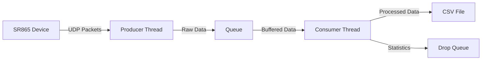

### Installation

#### 1. Clone the Repository with Submodules

Clone the repository and include all submodules in one step:

```bash
git clone --recursive https://github.com/sudoNeo/BarsukovGroupRefactoring.git
```

*If you have already cloned the repository without the `--recursive` flag, initialize and update the submodules manually:*

```bash
cd BarsukovGroupRefactoring
git submodule init
git submodule update
```

#### 2. Activate the Conda Environment (Recommended)

If you don’t already have a Conda environment for this project, create one using a compatible version of Python. Then, activate it:

```bash
conda create -n barsukov_env
conda activate barsukov_env
```


#### 3. Install Python Dependencies

Install the dependencies listed in `requirements.txt`:

```bash
pip install -r requirements.txt
```

#### 4. Install the `python-vxi11` Package

Navigate to the `python-vxi11` directory and install the package by running its setup script:

```bash
cd python-vxi11
python setup.py install
```

#### 5. Verify the Installation

Go back to the repository root (if necessary) and run the test script to make sure everything works correctly:

```bash
python test.py
```

*If `test.py` runs without errors, your installation is successful.*

---


**Notes**

* Need to implement signals and interrupts so that a Daemon class can instantiate the processes and also gracefully exit, i.e. turning queue putting/getting off and ignoring packets
* Vxi11 has invalid escape sequence wwarning but can be fixed with a raw string


## Understanding the Code 🧠

### What is this? 🤔
This is a Python program that helps scientists and researchers collect data from a special scientific instrument called the SR865 Lock-in Amplifier. Think of it like a super-smart digital recorder that can measure very tiny electrical signals with extreme precision!

### What Does It Do? 📊
Imagine you're trying to measure something really tiny and precise, like the electrical properties of new materials or checking how solar cells work. This program:
1. Connects to the SR865 instrument over your computer network
2. Continuously collects measurements (like a stream of numbers)
3. Saves all this data into files that you can later analyze
4. Can run multiple measurements at the same time (like having multiple recorders running)

### Tech Stack 🛠️
The program uses several cool technologies:
- **Python**: The main programming language
- **VXI-11**: A special protocol to talk to scientific instruments over networks
- **UDP**: A fast way to send data over networks (like a super-quick mail service)
- **Pandas**: A powerful tool for handling data in Python
- **Threading/Multiprocessing**: Allows the program to do multiple things at once
- **NumPy**: Helps with complex mathematical calculations
- **CSV**: Stores the data in files that spreadsheet programs can read

### How It Works 🔍
1. **Setup**: The program first connects to your SR865 instrument using its IP address
2. **Configuration**: Sets up how fast to collect data and what measurements to take
3. **Data Collection**: 
   - Opens a "stream" of data from the instrument
   - Collects measurements really fast (up to 100,000 times per second!)
   - Can measure different things like:
     - X and Y values (amplitude and phase)
     - R and θ (magnitude and angle)
4. **Data Storage**: Saves everything to files with timestamps

### How to Use It 🚀
1. Make sure your SR865 is connected to your network
2. Update the IP address in the code to match your instrument
3. Run the program with options:
   ```bash
   python multimain.py --address=192.168.1.156 --duration=12 --file=mydata.csv
   ```

### Options You Can Change 🎛️
- `--address`: Your SR865's IP address
- `--duration`: How long to collect data (in seconds)
- `--file`: Where to save the data
- `--rate`: How fast to collect data
- `--vars`: What to measure (X, XY, RT, or XYRT)
- `--thread`: Use multiple processes for better performance

### Ideas for Further Development 💡
Here are some cool things you could add to the program:

1. **Real-time Plotting**
   - Add live graphs while collecting data
   - Create a dashboard to see measurements in real-time

2. **Data Analysis**
   - Add automatic data processing
   - Calculate statistics and trends
   - Create automated reports

3. **User Interface**
   - Build a graphical interface (GUI)
   - Add buttons and controls for easier use
   - Create experiment presets

4. **Advanced Features**
   - Add automatic error detection
   - Implement data validation
   - Create experiment scheduling
   - Add remote control via web interface

5. **Data Export**
   - Add support for different file formats
   - Create automatic backup systems
   - Add cloud storage integration

6. **Machine Learning**
   - Add pattern recognition
   - Implement anomaly detection
   - Create predictive maintenance alerts

### Safety and Best Practices ⚠️
1. Always make sure your firewall allows UDP on your chosen port
2. Keep regular backups of your data
3. Test new features on sample data first
4. Document any changes you make to the code

### Technical Details 🔧
The program uses:
- UDP streaming for fast data collection
- Threading for parallel processing
- Buffered I/O for efficient data handling
- Error checking and packet validation
- Timestamp synchronization
- Configurable data formats

Remember: This is a powerful tool for scientific measurements. Take time to understand how it works before making changes!

## Data Pipeline & Multi-threading Architecture: Deep Dive 🔄

### Understanding the Big Picture 🌍
Before diving into the details, let's understand what we're trying to achieve:
- We need to collect data from a scientific instrument (SR865) very quickly
- The data comes in as packets over a network connection
- We need to process this data and save it without losing any packets
- We want to do all this efficiently without slowing down the data collection

Think of it like trying to fill water bottles from a fast-flowing tap:
- The tap (SR865) is constantly flowing (sending data)
- We need to catch all the water (data packets)
- We need to cap and label the bottles (process the data)
- We can't slow down the tap, or water will spill (lose packets)

### The Producer-Consumer Solution 🏭

#### Why Use This Pattern?
The producer-consumer pattern is like having two people work together:
- Person 1 (Producer) just focuses on catching water in bottles
- Person 2 (Consumer) focuses on capping and labeling bottles
- They have a shelf between them (Queue) where bottles can be placed

This is much more efficient than one person trying to do both jobs!

#### Producer (Data Collector) 🔍
```python
def fill_queue(sock_udp, q_data, count_packets, bytes_per_packet):
    for _ in range(count_packets):
        buf, _ = sock_udp.recvfrom(bytes_per_packet)
        q_data.put(buf)
```

What's happening here:
1. `sock_udp`: This is our "pipe" connected to the SR865 instrument
2. `q_data`: This is our "shelf" where we put collected data
3. `count_packets`: How many packets we need to collect
4. `bytes_per_packet`: How big each packet is

The producer's job is simple:
- Wait for data to arrive (`recvfrom`)
- Immediately put it in the queue (`put`)
- Don't do any processing - just collect!

#### Consumer (Data Processor) 📊
```python
def empty_queue(q_data, q_drop, count_packets, bytes_per_packet, fmt_unpk, 
               s_prt_fmt, s_channels, fname, bshow_status):
    for i in range(count_packets):
        buf = q_data.get()  # Waits for data if queue is empty
        vals, _, n_dropped, prev_pkt_cntr = process_packet(buf, fmt_unpk, prev_pkt_cntr)
        lst_stream += [vals]
```

The consumer's job is more complex:
1. Get data from the queue (`get`)
2. Process the data:
   - Unpack the binary data into numbers
   - Add timestamps
   - Check if we missed any packets
   - Format the data
3. Save the processed data
4. Keep track of any problems (dropped packets)

### The Queue System: Our "Shelf" 📦

#### Main Data Queue (`q_data`)
Think of this as a magical shelf:
- The producer can always add items (never runs out of space)
- The consumer can always take items
- If the shelf is empty, the consumer waits
- If the shelf is full, the producer waits
- Everything stays organized (First In, First Out - FIFO)

```python
queue_data = queue.Queue()  # Create our magical shelf
```

#### Drop Queue (`q_drop`)
This is like a notepad where we write down problems:
- Records any packets we missed
- Helps us track data quality
- Tells us if our system is working well

### How Threading Makes It All Work ⚡

```python
if b_use_threads:
    the_threads = []
    queue_drops = queue.Queue()
    queue_data = queue.Queue()
    
    # Create our workers
    for queue_func, queue_args in [
        (fill_queue, (the_udp_socket, queue_data, total_packets, bytes_per_pkt+4)),
        (empty_queue, (queue_data, queue_drops, total_packets, ...))
    ]:
        the_threads.append(threading.Thread(target=queue_func, args=queue_args))
        the_threads[-1].start()
```

What's happening here:
1. We create two queues:
   - One for the actual data
   - One for tracking problems
2. We create two workers (threads):
   - Producer thread: Runs `fill_queue`
   - Consumer thread: Runs `empty_queue`
3. Both workers start doing their jobs independently

### The Complete Data Journey 🌊



Let's follow a single piece of data:
1. **Birth**: SR865 creates a measurement
2. **Travel**: Data travels over UDP to our computer
3. **Collection**: Producer thread receives the data
4. **Queuing**: Data goes into the main queue
5. **Processing**: Consumer thread:
   - Gets the data
   - Unpacks it
   - Adds a timestamp
   - Checks for missing packets
6. **Storage**: Data is saved to a CSV file
7. **Quality Check**: Any issues are recorded in the drop queue

### Error Handling: When Things Go Wrong 🔧

#### Packet Loss Detection
```python
if prev_pkt_cntr is not None and ((prev_pkt_cntr+1)&0xff) != cntr:
    n_dropped = cntr - prev_pkt_cntr
```

This is like checking if we missed any bottles:
- Each packet has a number
- We check if the numbers are sequential
- If we skip a number, we know we missed a packet
- We record how many we missed

#### Graceful Shutdown
```python
def cleanup_ifcs():
    the_vx_ifc.write('STREAM OFF')
    the_vx_ifc.close()
    the_udp_socket.close()
```

This is like proper cleanup:
- Tell the SR865 to stop sending data
- Close all our connections
- Make sure everything is tidy before quitting

### Making It Fast: Performance Tricks 🚀

1. **Smart Buffering**
   - We use different packet sizes (1024, 512, 256, 128 bytes)
   - Bigger packets = more efficient network use
   - Smaller packets = less memory use
   - We choose based on our needs

2. **Automatic Speed Control**
   ```python
   f_rate = f_rate_max/(2.0**i_decimate)
   ```
   This is like adjusting the water flow:
   - Check how fast data can come in
   - Adjust our collection rate to match
   - Prevent overflow or data loss

3. **Thread Timing**
   - Producer gets extra 2 seconds
   - Consumer gets extra time to finish processing
   - Ensures we don't cut off data collection too early

### Real-World Impact 🌟

This architecture allows us to:
1. Collect data at very high speeds (up to 100,000 samples per second)
2. Not miss any important measurements
3. Keep everything organized and timestamped
4. Know if there were any problems
5. Save data in a useful format

### Future Possibilities 🔮

We could enhance this system by:
1. Adding more consumers for parallel processing
2. Creating real-time data visualization
3. Adding automatic error recovery
4. Implementing data validation
5. Adding remote monitoring capabilities

The beauty of this design is that it's modular - we can add new features without breaking what already works!

## Data Pipeline & Multi-threading Architecture 🔄

### Producer-Consumer Pattern
The codebase implements a classic producer-consumer pattern using Python's threading and queue mechanisms. Here's how it works:

#### Producer (Data Collection) 🔍
```python
def fill_queue(sock_udp, q_data, count_packets, bytes_per_packet):
    for _ in range(count_packets):
        buf, _ = sock_udp.recvfrom(bytes_per_packet)
        q_data.put(buf)
```
- The producer thread (`fill_queue`) continuously receives data packets from the SR865 via UDP
- Each packet is immediately placed into a thread-safe queue (`q_data`)
- This thread runs independently, ensuring no data is lost due to processing delays

#### Consumer (Data Processing) 📊
```python
def empty_queue(q_data, q_drop, count_packets, bytes_per_packet, fmt_unpk, 
               s_prt_fmt, s_channels, fname, bshow_status):
    for i in range(count_packets):
        buf = q_data.get()  # Blocks until data is available
        vals, _, n_dropped, prev_pkt_cntr = process_packet(buf, fmt_unpk, prev_pkt_cntr)
        lst_stream += [vals]
```
- The consumer thread (`empty_queue`) processes data from the queue
- Handles data unpacking, timestamp addition, and packet loss detection
- Manages data storage and status updates

### Queue Management System 📦

1. **Main Queue (`q_data`)**
   - Thread-safe Queue object from Python's `queue` module
   - Buffers raw data packets between producer and consumer
   - Automatically handles thread synchronization
   - Prevents memory overflow through built-in blocking

2. **Drop Queue (`q_drop`)**
   - Secondary queue for tracking packet loss statistics
   - Used for quality control and debugging
   - Communicates packet loss info back to main thread

### Thread Synchronization ⚡

```python
if b_use_threads:
    the_threads = []
    queue_drops = queue.Queue()
    queue_data = queue.Queue()
    
    # Start producer and consumer threads
    for queue_func, queue_args in [
        (fill_queue, (the_udp_socket, queue_data, total_packets, bytes_per_pkt+4)),
        (empty_queue, (queue_data, queue_drops, total_packets, ...))
    ]:
        the_threads.append(threading.Thread(target=queue_func, args=queue_args))
        the_threads[-1].start()
```

#### Timing Control
- Producer thread timeout: `duration_stream + 2` seconds
- Consumer thread timeout: `duration_stream * 2` seconds
- Ensures graceful shutdown even if data collection is incomplete

### Data Flow Pipeline 🌊


1. **Data Acquisition**
   - UDP packets received from SR865
   - Timestamped at reception
   - Placed in queue immediately

2. **Data Processing**
   - Packet unpacking and validation
   - Dropped packet detection
   - Data formatting and timestamping

3. **Data Storage**
   - CSV file writing with headers
   - Optional data interpolation
   - Error statistics collection

### Error Handling & Recovery 🔧

1. **Packet Loss Detection**
   ```python
   if prev_pkt_cntr is not None and ((prev_pkt_cntr+1)&0xff) != cntr:
       n_dropped = cntr - prev_pkt_cntr
   ```
   - Tracks packet sequence numbers
   - Calculates gaps in sequence
   - Records statistics for quality control

2. **Graceful Shutdown**
   ```python
   def cleanup_ifcs():
       the_vx_ifc.write('STREAM OFF')
       the_vx_ifc.close()
       the_udp_socket.close()
   ```
   - Proper resource cleanup
   - Handles SIGINT signals
   - Ensures device is left in known state

### Performance Considerations 🚀

1. **Buffer Sizes**
   - Packet sizes: [1024, 512, 256, 128] bytes
   - Queue size automatically managed by Python
   - Memory usage scales with data rate

2. **Threading Overhead**
   - Minimal context switching due to I/O-bound nature
   - GIL impact minimized by UDP blocking
   - Thread timeouts prevent resource leaks

3. **Data Rate Management**
   ```python
   f_rate = f_rate_max/(2.0**i_decimate)
   ```
   - Automatic rate adjustment
   - Prevents buffer overflow
   - Matches device capabilities

### Future Improvements 🔮

1. **Potential Enhancements**
   - Add thread pool for parallel processing
   - Implement circular buffer for continuous operation
   - Add real-time data visualization

2. **Scaling Considerations**
   - Multiple device support
   - Distributed processing
   - Real-time analysis pipeline

This architecture ensures reliable high-speed data acquisition while maintaining data integrity and system stability. The producer-consumer pattern with queuing provides a robust foundation for future enhancements and scaling.